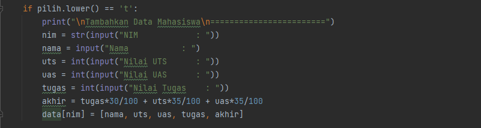
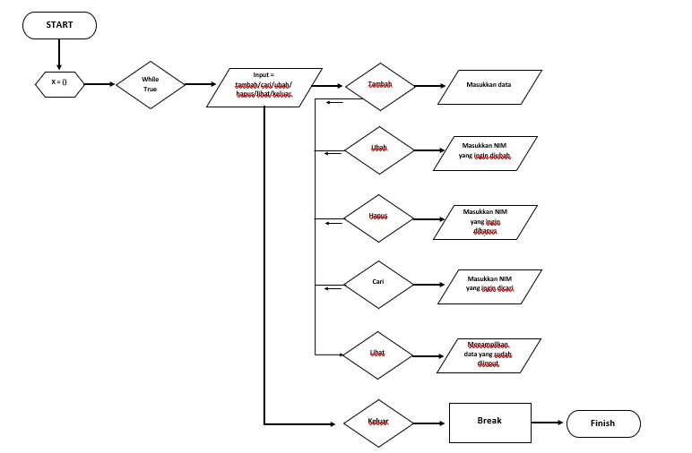

# PRAKTIKUM 5
| No | DAFTAR ISI | LINKS                                                                |
|-------------|------------|----------------------------------------------------------------------|
|  1 | Latihan    | [Menuju Kesini](https://github.com/RhendyDikiN/Praktikum5#latihan)   |
|  2 | Praktikum  | [Menuju Kesini](https://github.com/RhendyDikiN/Praktikum5#praktikum) |
|  3 | Flowchart  | [Menuju Kesini](https://github.com/RhendyDikiN/Praktikum5#flowchart) |
|  4 | Penutup    | [Menuju Kesini](https://github.com/RhendyDikiN/Praktikum5#penutup)   |

Praktikum kali ini berisi tentang fungsi dictionary dari python. Seperti biasa, Saya akan membuat Latihan, Praktikum, beserta Flowchartnya. Langsung saja masuk ke Latihan :
## Latihan
Isi program dari latihan dictionary ini adalah sebagai berikut :<br/>
• Membuat dictionary daftar kontak, dengan ketentuan ( Nama sebagai key, dan nomor sebagai value).<br/>
• Menampilkan kontak Ari<br/>
• Menambah kontak baru bernama Riko dengan nomor 087654544<br/>
• Mengubah kontak Dina dengan nomor baru 088999776<br/>
• Menampilkan semua Nama<br/>
• Menampilkan semua Nomor<br/>
• Menampilkan semua daftar Nama dan Nomornya<br/>
• Dan yang terakhir menghapus kontak Dina.<br/><br/>
Jika dibuat program python maka akan seperti ini :<br/>
<br/><br/>
Program ini jika dijalankan, maka akan mendapati hasil RUN seperti ini :<br/>
<br/><br/>
Nah, inilah isi dari latihan nya. Setelah ini, Saya akan langsung membuat praktikum dari Dictionary ini.<br/>
## Praktikum
Di praktikum ini, Saya akan membuat suatu program input nilai. Yang mana, dalam program ini... Saya menggabungkan fungsi list dan dictionary.<br/><br/>
Perintahnya adalah sebagai berikut :<br/>
• Membuat program sederhana yang menampilkan daftar nilai dengan ketentuan,<br/>
• Program dibuat dengan menggunakan Dictionary<br/>
• Menampilkan menu pilihan: (Tambah data, ubah data, hapus data, cari data, dan menampilkan data)<br/>
• Nilai akhir harus diambil dari perhitungan 3 nilai (tugas: 30%, uts: 35%, uas: 35%)<br/><br/>
Nantinya program akan berjalan seperti ini :<br/>
<br/><br/>
Langsung saja, Saya akan buat program pyton nya.<br/>
```
print("====================\nProgram Input Nilai\n====================")
data = {}


while True:
    pilih = input("\n(T)ambah, (U)bah, (H)apus, (C)ari, (L)ihat, (K)eluar: ")

    if pilih.lower() == 't':
        print("\nTambahkan Data Mahasiswa\n========================")
        nim = str(input("NIM            : "))
        nama = input("Nama           : ")
        uts = int(input("Nilai UTS      : "))
        uas = int(input("Nilai UAS      : "))
        tugas = int(input("Nilai Tugas    : "))
        akhir = tugas*30/100 + uts*35/100 + uas*35/100
        data[nim] = [nama, uts, uas, tugas, akhir]

    elif pilih.lower() == 'u':
        print("\nMengubah Data Mahasiswa\n========================")
        nim = str(input("NIM            : "))
        if nim in data.keys():
            nama = input("Nama           : ")
            uts = int(input("Nilai UTS      : "))
            uas = int(input("Nilai UAS      : "))
            tugas = int(input("Nilai Tugas    : "))
            akhir = tugas * 30 / 100 + uts * 35 / 100 + uas * 35 / 100
            data[nim] = nama, uts, uas, tugas, akhir
        else:
            print("NIM {0} tidak ditemukan".format(nim))

    elif pilih.lower() == 'h':
        print("\nMenghapus Data Mahasiswa\n========================")
        nim = str(input("Masukkan NIM   : "))
        if nim in data.keys():
            del data[nim]
            print("Data berhasil dihapus")
        else:
            print("NIM {0} Tidak Ditemukan".format(nim))

    elif pilih.lower() == 'c':
        print("\nMencari Data Mahasiswa\n========================")
        nim = input("Masukkan NIM  : ")
        if nim in data.keys():
            print("="*77)
            print("|                                Daftar Mahasiswa                           |")
            print("="*77)
            print("| NO |    NIM    |         Nama         |  UTS  |  UAS  |  Tugas  |  Akhir  |")
            print("="*77)
            i = 0
            for j in data.items():
                i += 1
            print("| {no:2d} | {0:9s} | {1:20s} | {2:5d} | {3:5d} | {4:7d} | {5:7.2f} |"
                  .format(nim, nama, uts, uas, tugas, akhir, no=i ))
            print("="*77)
        else:
            print("NIM  {0} Tidak Ditemukan".format(nim))

    elif pilih.lower() == 'l':
        if data.items():
            print("="*78)
            print("|                               Daftar Mahasiswa                             |")
            print("="*78)
            print("| NO |    NIM    |         Nama         |  UTS  |  UAS  |  Tugas  |  Akhir  |")
            print("="*78)
            i = 0
            for z in data.items():
                i += 1
                print("| {no:2d} | {0:9s} | {1:20s} | {2:5d} | {3:5d} | {4:7d} | {5:7.2f} |"
                      .format(z[0][:13], z[1][0], z[1][1], z[1][2], z[1][3], z[1][4], no=i))
            print("=" * 78)
        else:
            print("="*78)
            print("|                               Daftar Mahasiswa                             |")
            print("="*78)
            print("| NO |     NIM      |       Nama       |  UTS  |  UAS  |  Tugas  |   Akhir   |")
            print("="*78)
            print("|                                TIDAK ADA DATA                              |")
            print("="*78)

    elif pilih. lower() == 'k':
        break

    else:
        print("Pilihan tidak ada! Pilih menu yang tersedia.")
```


1) Pertama, membuat dictionary tanpa isi, karena nantinya data ini akan diinput oleh kita.<br/>
<br/><br/>
2) Lalu, buat sebuah kondisi untuk perulangan dan sebuah pilihan menu sesuai dengan apa yang diperintah kan.<br/>
<br/><br/>
3) Selanjutnya membuat syntax input menambahkan data. Syntax ini akan berjalan, jika kita memilih 't' <br/>
<br/><br/>
4) Membuat syntax untuk mengubah data. Syntax ini berjalan ketika kita memilih 'u', dan nantinya kita akan diminta menginputkan data yang mau diubah. Jika data tidak ada maka akan muncul "NIM tidak ditemukan"<br/>
<br/><br/>
5) Membuat syntax hapus data. Nantinya kita bisa menghapus data jika memilih 'h' dan kita akan diminta menginputkan data yang akan dihapus<br/>
<br/><br/>
6) Membuat lagi syntax untuk mencari data. Jika memilih 'c', kita akan diminta memasukan data yang akan dicari. Jika data yang dimasukkan ada maka akan muncul, tapi jika data yang dimasukkan tidak terdaftar maka akan muncul "NIM tidak ditemukan"<br/>
<br/><br/>
7) Membuat syntax untuk menampilkan data. Data akan ditampilkan, jika pilihannya 'l' semua data yang sudah ditambahkan akan ditampilkan. Tapi jika tidak ada akan muncul "TIDAK ADA DATA"<br/>
<br/><br/>
8) Syntax untuk menghentikan perulangan perlu ditambahkan, disini untuk memberhentikan program adalah dengan memilih 'k', maka program akan langsung berhenti.<br/>
<br/><br/>
9) Dan yang terakhir, kita buat syntax jika pilihan yang kita masukan tidak ada para menu (T,U,C,H,L,K). Nantinya kita akan diminta lagi untuk memasukkan pilihan sesuai dengan yang ada di menu.<br/>
<br/><br/>

Nah, semua syntax / coding ini. Jika dijalankan atau RUN, maka akan menghasilkan output sebagai berikut :<br/>
1) Tambah data + Lihat data<br/>
<br/><br/>
2) Ubah data + Lihat data<br/>
<br/><br/>
3) Mencari data<br/>
<br/><br/>
4) Hapus data + Lihat data<br/>
<br/><br/>
5) Keluar dan mengakhiri program<br/>
<br/><br/>

Jadi itulah program yang telah saya buat, adapun untuk Flowchart dari praktikum ini :
### Flowchart
<br/><br/>

## Penutup
Sekian dari tugas Modul Praktikum 5 yang sudah Saya kerjakan. Jika ada kesalahan kata atau pengetikan, Saya mohon maaf... Sekian, Saya ucapkan Terimakasih<br/><br/>

Nama    : Rhendy Diki Nugraha <br/>
NIM     : 312210150<br/>
Kelas   : TI.22.A1<br/>
Dosen   : Agung Nugroho, S.Kom, M.Kom